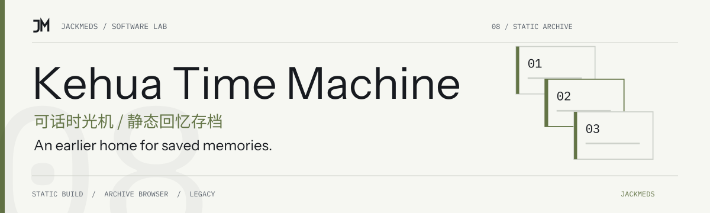

<!-- jackmeds-brand:start -->
<picture>
  <source media="(prefers-color-scheme: dark)" srcset="assets/brand/hero-dark.svg">
  
</picture>
<!-- jackmeds-brand:end -->

# 可话时光机 · kehua-time-machine

可话回忆查看器的静态构建仓库，让导出的文字、图片和视频重新成为可浏览的记忆。

A static build of a Kehua memory viewer. Import a local export folder or ZIP archive to browse its posts and media in the browser.

## 从这里开始

这个仓库保存的是编译后的页面：[index.html](index.html) 与 [assets/](assets/)。页面自身显示名称为「可话花园」。完整源码与开发说明请看 [kehua-memory-garden](https://github.com/JackMeds/kehua-memory-garden)。

如需体验，可从 [可话花园的在线入口](https://jackmeds.github.io/kehua-memory-garden/) 开始。本仓库的构建文件也可以用本地静态服务器预览。

## 本地预览

需要 Python 3。在本仓库目录运行：

```bash
python3 -m http.server 8080 --bind 127.0.0.1
```

浏览器打开 `http://127.0.0.1:8080/`，选择解压后的可话导出文件夹或 ZIP 文件。页面模块通过 HTTP 加载，请使用静态服务器预览。

仓库没有 `package.json` 或应用源码，不提供 `npm install`、开发热更新或重建命令；修改功能应到源码仓库完成后重新生成静态文件。

## 数据与限制

- 构建中的导入界面支持文件夹与 ZIP，并索引导出资料中的文字、图片和视频。
- 资料由浏览器在本机解析；保留原始导出包作为备份。
- 页面引用 Google Fonts，加载字体仍会产生网络请求；本地数据处理不等于所有页面资源都已离线缓存。
- 能否读取完整内容取决于原始导出文件及其目录结构。页面构建不能恢复导出包中缺失的媒体。

## 维护与许可

这是静态产物入口，与 [可话花园源码仓库](https://github.com/JackMeds/kehua-memory-garden) 分开保存。当前仓库没有项目级许可证文件，本次文档整理不新增授权声明。
